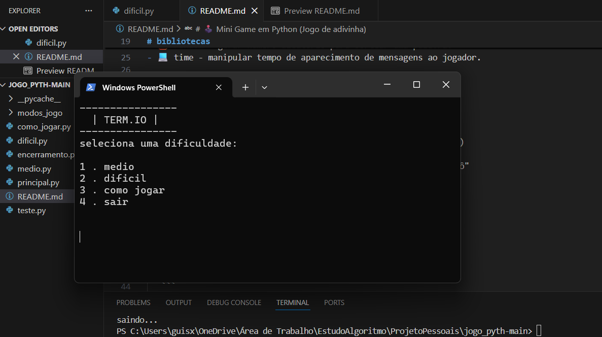
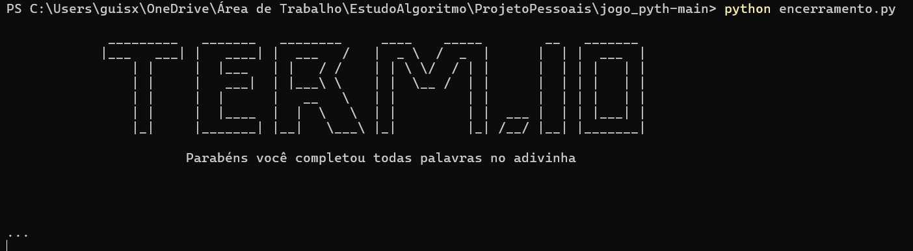
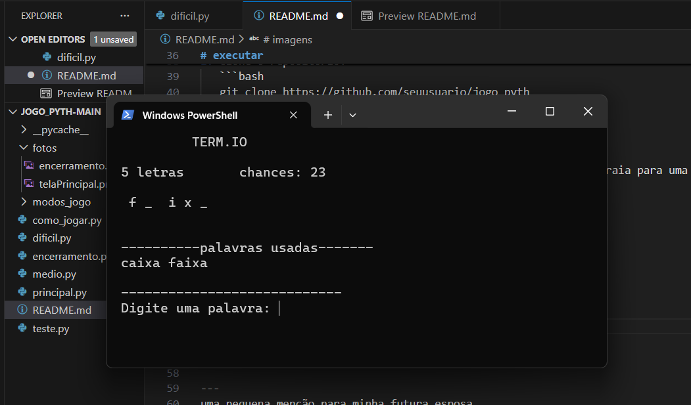

# 🕹️ Mini Game em Python (Jogo de adivinha)


<p align="center">
<a href="#bibliotecas">o que foi utilizado📚</a>
<a href="#funcionalidades">como funciona?🎮</a>
<a href="#executar">como executar?🛠️</a>
<a href="#jogatina">como jogar?💿</a>
<a href="#aprendizados">o que foi compreendido?🧠</a>
<a href="#imagens">imagens do projeto📸</a>
<a href="#atualizacao">o que foi adicionado?📝</a>
</p>

<p style="text-align: center;">
Esse projeto foi construido em finalidade de conceber as habilidades básicas em <strong>Python e suas bibliotecas simples</strong> e <strong>lógica de programação </strong>para dinamizar o jogo.  
O algoritmo permite dificuldades escalares usando o mesmo princípio, mas sem mudar a finalidade principal do jogo.
</p>
---

# bibliotecas

- 🐍 Python - 5 arquivos, principal.py, medio.py, encerramento.py, dificil.py e como_jogar.py.
- 🧠 OS - para manipular o terminal.
- 🖼️ sys - para comandos no terminal.
- 🧮 random - gerar numero aleatório para sortear uma palavra.
- 💻 time - manipular tempo de aparecimento de mensagens ao jogador.
- 🎹 pygame -  para manipular as musicas de fundo.

    tecnologia usada:
	python versão 3.11
	editor Visual Studio Code

---

# funcionalidades

- Opções de dificuldade entre os níveis.
- Breve tutorial para auxiliar o jogador.
- funcionalidade de dicas ao jogador sobre as vogais presentes na palavra a ser adivinhada.

---

# executar

1. Clone o repositório:
   ```bash
   git clone https://github.com/seuusuario/jogo_pyth
   cd pychat
   ```

   ```bash
   Ou baixe os arquivos disponíveis na branch mais recente e extraia para uma pasta
   ```

2. Execute o jogo:
   	```bash
   python principal.py
	```

# jogatina

         Modo médio:
         Há um indicativo de quantas letras tem na palavra, se o jogador acertar a posição e qual letra na sua 'tentativa' então a letra sera exibida e 
         ajudará a formar a palavra para advinhar
         Há também quantidade de letras e chances são exibidas na tela pra ajudar o jogador

         modo difícil:
         acréscimo de uma palavra para descobrir, aproveitando da mesma mecânica da dificuldade anterior

# imagens

<i>tela principal</i>


<i>tela de encerramento após a conclusão</i>

<i>tela de jogo</i>




# aprendizados

Esse projeto ajudou no entendimento de:
- Lógica de programação com a linguagem python.
- Gerenciamento de múltiplos arrays.
- Gerenciamento de bibliotecas para gerar valores no funcionamento do jogo.
- Importações de arquivos com uso de módulos.
- uso de pequenas janelas para exibição de texto.
 
---

# atualizacao

                                                                25/06/2025
                                                            Projeto completo.

                                                                30/11/2025
                                                        Adição de música no menu.
                                                        créditos aos sons usados.
                                                        homenagem a minha esposa.

<i>no menu: 08122022</i>
